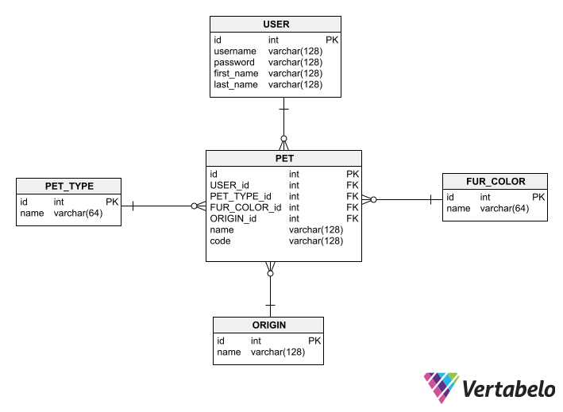

How to run?

1. git clone project
2. open project
3. run main method in WiserCatProjectApplication class. Path: src/main/java/com/example/wisercatproject/WiserCatProjectApplication.java
4. make sure, what application is running on the localhost with port 8080

Project description:

This is application, where you can log in your account and list, add or update your pets.
 
 
Application uses several models: User, Pet, PetType, FurColor, Origin.
 
The database tables of those models are already included in H2 database by using liquibase xml files.
 
You can find models in "model" package and liquibase scripts in "resources" folder.

ERD of my application database

Server side application is divided into layers.
1. Data access layer (repositories)
2. Business logic layer (services)
3. Application layer (controllers)

In order to easily get and send data from server side to client side and vice versa I included DTOs and Object Mappers in my project.
It This helps limit the information received on the client side (user does not need to have ids of pet type or pet origin).
 
 
When user sends "put" or "post" requests on the back-end, my application uses Hibernate Validator validate application models constraints.
